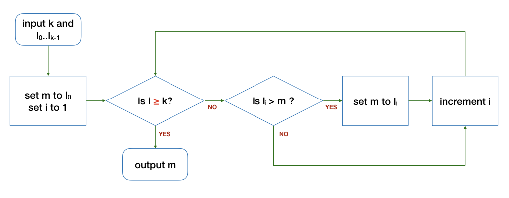
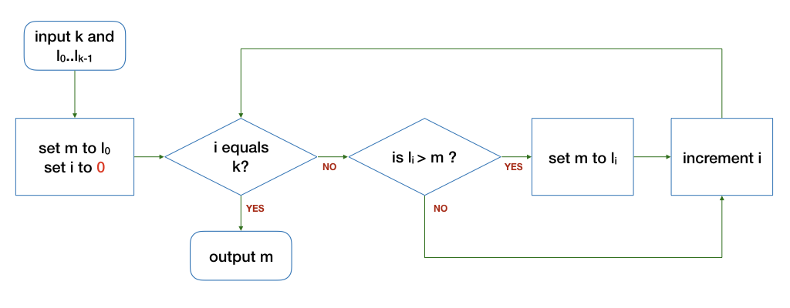
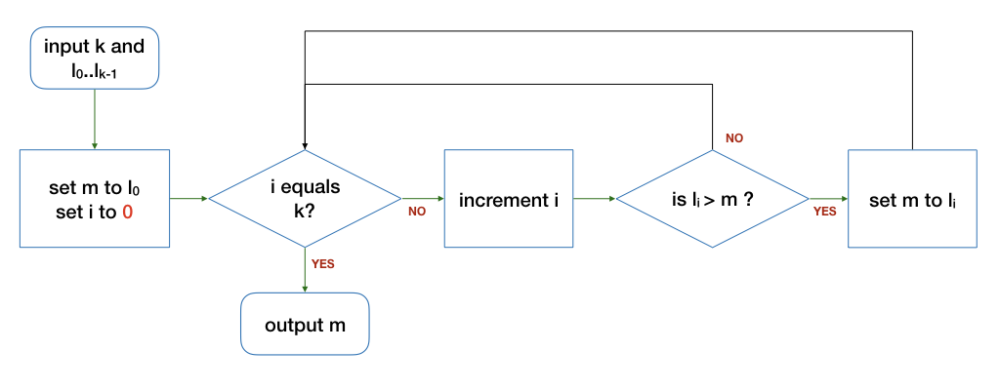

# Unit 2: Computational Problems and Algorithms

## Learning Outcomes:

After this unit, students should:

- understand the basic terminologies: computational problem solving, algorithm, flowchart, debugging, testing, variables, value, assignment
- be familiar with the algorithm to find the maximum among a list of numbers
- be able to trace through flowcharts and updates of variables, and argue if a given algorithm is correct or incorrect

## Computational Problems

So, what is computational problem solving?  Let's start with the question, what is a _computational problem_?  

A computational problem is a problem that can be solved step-by-step with a computer.  These problems usually have a well-defined input, constraints, and conditions that the output must satisfied.  Here are some types of computational problems:

- A _decision problem_ is one where the answer is yes or no.  For instance, "given a number `n`, is `n` even?" is a decision problem.  Some decision problems take more steps to solve than others.  For instance, "given a number `n`, is `n` prime?" takes more steps than just checking the parity of a number.

- A _search problem_ is one where the solution consists of one or more values that satisfies a given condition.  For instance, we may want to compute a path from one geographical location to another on a map.

- A _counting problem_ is one where the answer is the number of solutions to a search problem.

- An _optimization problem_ is one where the solution is the "best" possible solution, where the "best" can be defined in a different way.  For instance, we may want to compute the fastest route from one location to another.

Questions such as "what is the meaning of life?" "do I look good in this outfit?"[^1] are not computational problems, because they do not have well-defined input, constraints, and conditions that the output must satisfy.

[^1]: The answer is, by the way, always "Yes."

In CS1010 (followed by CS2040C and CS3230), you will learn how to solve computational problems _computationally_ -- this means that you learn to come up with step-by-step instructions meant for computers that you can translate into computer programs, to solve a given problem. 

## Example: Finding the maximum 

Let's start with a simple problem.  Given a finite list $L$ of $k$ integers ($k$ > 0), find the integer with the maximum value from the list.

First, let's consider if this is a computational problem.  The input is very well defined.  We know what an integer is.  We are told we have at least one, and we have a finite number of them[^2].

[^2]: Think about why it is important to have a finite number of integers in the input.

Second, let's consider the output.  What conditions must the output satisfy?  First, it has to be equal or larger than every other integer on the list.  Second, it must be an integer _in_ the list.  This is well defined by the problem statement, so we can say that it is a computational problem.

Here is an example.  Suppose the input consists of:

`4 1 -4 0 9 9 3 5 8`

The output should be `9`.

Now, you should pause reading and think about how you would solve this step-by-step.  

### Algorithm

One way to solve this problem is to check through the integers in the list, one-by-one, and keep track of the maximum value so far.  When you reach the end of the list, your "maximum value so far" will also be the maximum for the whole list.  

Let's look at an example:

| Integers Scanned | Maximum So Far |
|------------------|----------------|
| `4` | `4` |
| `4 1` | `4` |
| `4 1 -4` | `4` |
| `4 1 -4 0` | `4` |
| `4 1 -4 0 9` | `9` |
| `4 1 -4 0 9 9` | `9` |
| `4 1 -4 0 9 9 3` | `9` |
| `4 1 -4 0 9 9 3 5` | `9` |
| `4 1 -4 0 9 9 3 5 8` | `9` |

The English description above, however, is not detailed enough for computers to understand.  What is the meaning of "check one-by-one"? "keep track of maximum so far"?  how to tell if we have reached "the end of the list"?

Let's work out all the details.

First, we need a concise way of representing the integers in the list.  Borrowing from mathematical notation, let's say that the list $L$ contains the integers 
$l_0, l_1, ..., l_{k-1}$. To "check one-by-one," we introduce another notation $l_i$, which is the integer currently being "checked".  We begin with $i = 0$, then $i = 1$, then $i = 2$, etc, until $i = k-1$.  At every step, we increase $i$ by 1.

Second, we need a concise way of keeping track of the maximum so far.  We introduce another notation, $m$, to represent the maximum value so far.  When $i = 0$, $m = l_0$.  Since we only scan a single integer, it has to be the maximum.  When we check another integer $l_i (i > 0)$, only two things can happen:

- if this $l_i$ is larger than $m$, then $l_i$ has to be the maximum so far, so we update $m$ to be $l_i$.
- if $l_i$ is equal to or smaller than $m$, then $m$ is still the maximum value so far.

We keep doing the above and increase $i$, until we reach the end of the list when (after increasing $i$) we find that $i$ is $k$.

Now, we have enough details to describe step-by-step, how to find the maximum value from a list of integers.  Such steps, which the computer can take to solve a problem, is called an _algorithm_.  

### Flowchart

There are different ways one can describe an algorithm.  The easiest way I find is to use a diagram called a _flowchart_.  The flowchart for the algorithm above looks like this.  A diamond box represents a "question" that can be true or false (yes or no), and we trace through the "flow" step by step, following the corresponding path depending on the answer. 

Please spend some time to trace through the walkthrough above.  The snapshot of the values of the $i$, $l_i$, $k$, and $m$, at the point after "is $i$ equals $k$" is shown in the table below (except for the first row, which shows the value just before entering "is $i$ equals $k$.").

| Integers Scanned | $i$ | $l_i$ | $k$ | Maximum So Far ($m$) |
|------------------|-----|-------|-----|----------------|
| `4` | `1` | `4` | `9` | `4` | 
| `4 1` | `1` | `1` | `9` | `4` | 
| `4 1 -4` | `2` | `-4` | `9` | `4` |
| `4 1 -4 0` | `3` | `0` | `9` | `4` | 
| `4 1 -4 0 9` | `4` | `9` | `9` | `4` | 
| `4 1 -4 0 9 9` | `5` | `9` | `9` | `9` | 
| `4 1 -4 0 9 9 3` | `6` | `3` | `9` | `9` | 
| `4 1 -4 0 9 9 3 5` | `7` | `5` | `9` | `9` | 
| `4 1 -4 0 9 9 3 5 8` | `8` | `8` | `9` | `9` | 
| `4 1 -4 0 9 9 3 5 8` | `9` | `` | `9` | `9` | 

### Variables

There are a few important things to take note here.  $m$, $i$, $k$, and the list $L$ are what we called _states_ or _variables_.  While in the above, we can think of them as mathematical variables which we can assign _values_ to, in a computer program, a variable is a location in the memory which holds a value.  

We can perform two very basic operations on the variables: reading and writing.  In other words, we can set their values and we can retrieve their values. 

We can _assign_ the value of one variable to a constant (e.g., set $i$ to 1) or to the value of another variable (e.g., set $m$ to $l_i$).  In the latter example, we first read the value of $l_i$, from $l_i$'s memory location and then we write that value to the memory location of $m$.  Once written, the value of $m$ will not change until the next time we update the value of $m$.

It is important to note that, when $i$ changes, $m$ _does not change automatically_ to the new $l_i$  This behavior is different from that which you may be familiar with in spreadsheet software -- if you set the value of a cell, say `A1` to be `=B1`, when the value in cell `B1` changes, the value `A1` also changes automatically.

We can also compare the values of two variables.  We see two examples above: "$i$ equals $k$?"  "$l_i > m$?"  When we compare, we read the values of the variables from their memory location and checks their relations.

We can perform arithmetic operations on the variables: addition, subtraction, etc.  We see one example above: "increment $i$".  This operation is actually an assignment operation in disguise.  We can write it as "set $i$ to $i$ + 1".  Here, you see that $i$ is referred to twice.  This operation reads the value from the memory location of $i$, adds 1 to it, and then writes the resulting value back to the location of $i$.

### Bugs

If you follow the execution of the algorithm above, step-by-step, using the example input `4 1 -4 0 9 9 3 5` above, you will obtain the correct maximum value $m$ of `9`.  But does that mean that the algorithm is correct?  The answer is NO.  

For an algorithm to correctly solve the given problem, it has to produce the correct result for all valid inputs to the problem.  If we can find one counterexample, one input where the algorithm does not produce the correct output, then the algorithm is incorrect.  Note that I say _does not produce the correct output_, which means that either the algorithm  _produces the wrong output_ or _does not produce any output at all_.  

In this case, we say that the algorithm or the program has a _bug_.  A bug is a defect that causes the algorithm to behave incorrectly.  As a software developer, you will spend some time finding bugs in your code, a process known as _debugging_.  A _debugger_ is a tool that helps programmers find bugs in their code.

Before we even start the process of debugging, we first have to know if our algorithm is correct.  Remember that an algorithm is correct only if it produces the correct output only all possible valid inputs.  So, one way to check if an algorithm is correct is to try it with all possible valid inputs.  For the problem we are solving above, however, even though the list is finite, there are infinitely many possible inputs, and so, it is impossible to try all possible valid inputs.  In practice, we _craft_ a smaller set of test inputs to check if the algorithm behaves correctly for these test inputs, and _hope_ that it is correct for all possible inputs.  With experience, you will choose the right set of test inputs to maximize that chances that you will find a bug in your code.  There are also systematic ways of deriving test cases so that the test cases _cover_ different paths of execution of the algorithm, but we won't be covering it in CS1010[^3].

[^3]: Software testing is a body of knowledge worthy of an advanced module by itself -- we offer one in CS4218.

Another way of checking if an algorithm is correct, is to reason about the behavior of the algorithm.  We will do this rather informally in CS1010, starting in 1-2 lectures from now.  You get to rigorously prove that an algorithm is correct in a higher level module (CS3230 Design and Analysis of Algorithms).

Finally, even if an algorithm is correct, the corresponding program might not be.  Recall that an algorithm is a step-by-step process to solve a problem.  It is what you want your program to do.  You still have to write a program (in C, or other languages) to actually have the computer do what you want it to do (in other words, to _implement the algorithm_). This process of translating the algorithm to a computer program, called _coding_ may introduce bugs as well.  But we will worry about this later when we learn to program.

In the problem set at the end of this lecture, you will see slight variations of the algorithm above.  You should check through them to see whether they are correct or not.

## Problem Set

#### Problem 1.1 

The following algorithms are slight variations of the one in the notes above.  The differences are highlighted in red.  Do they correctly find the maximum integer from a finite list of $k$ integers ($k > 0$)?  

If an algorithm is buggy, give a counter-example where the output is incorrect.  In addition, give an example input where the algorithm still produces the correct output, where possible.  

(a). 

(b). 

(c). 

(d). 

(e). 

#### Problem 1.2

Change the algorithm above to find the minimum value instead of the maximum value from the given list $L = \{l_0, ..., l_{k-1}\}$.

#### Problem 1.3

Draw the flowchart for an algorithm, that takes in a list of integers $L = \{l_0, ..., l_{k-1}\}, k \ge 0$, and compute the _sum_ of all the integers.  Think about what variable(s) do you need.
