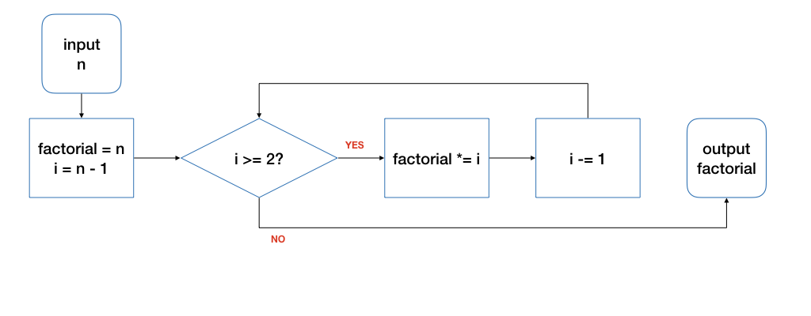
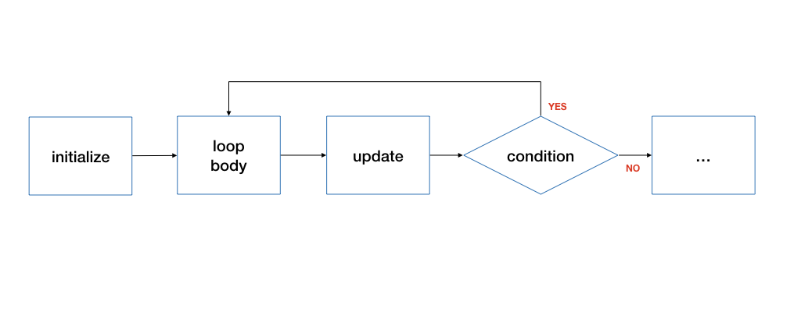
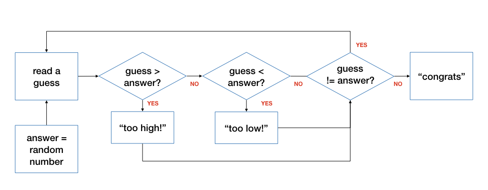

# Unit 11: Loops

In [Unit 8](08-if-else.md), you were introduced to writing code that follows one of two possible execution paths using the `if`-`else` statements, using a logical expression to decide which path to take.

Sometimes, we want to execute one of the branches repeatedly (or interatively), over-and-over again, until a certain logical condition is met.  You have seen this construct in the $max$ and $sum$ example, where we repeatedly go through the numbers in the list until $i == k$.

## Writing Loops

To write a loop, we need to think about the following four questions:

- what do we want to do repeatedly?
- what do we need to set up before repeating the above?
- what changes from one repetition to another?  
- how to decide if we should stop repeating (or conversely, to continue repeating?)

There is a fifth question that is as important as the above but is harder to answer (and not necessary for writing simple loops), so we will leave it to [Unit 12](12-invariant.md).

Let's revisit the example of `max`.  Here is the answer to the questions:

- What do we want to do repeatedly?  We want to compare the element $l_i$ to $m$, and update $m$ to $l_i$ if $l_i > m$.

- What do we need to set up before repeating the above?  We need to have some initial value of $m$ and $i$.  We set it up as $m = l_0$ and $i = 1$.

- What would be different each time we repeat the above?  Every time we repeat, $i$ will be different.  To be more precise, $i$ is one more than before.

- How to decide if we should continue repeating the above?  We stop when there is no more element to compare, i.e., $i$ equals $k$.  In other words, we continue if $i < k$.


Let's consider another example.  We have seen how to compute factorial recursively.  Let's try to compute factorial using a loop.

Recall that $n! = n \times n-1 \times n-2 .. 2 \times 1$.  Given $n$, how do we find $n!$ using a loop?  

The idea to solve this with a loop is to start with the value $n$, and repeatedly multiply another value $i$, starting with $i = n - 1$, then $i = n - 2$, etc, until $i = 2$.  We do not need to multiple with $i = 1$ since it does not change the value.

Like any other problem, we need to consider what are the variables we need to maintain.  In this case, we should maintain the partial product of the factorial and a variable $i$ that corresponds to value to multiple into the partial product.

- What do we want to do repeatedly?  Multiply $i$ into the partial product. 
- What do we need to set up before repeating the above?  We set up the partial product to be $n$ and $i$ to be $n - 1$.
- What changes from one repetition to another?  $i$ would decrease by one every time we repeat the above.
- How to decide if we should stop repeating (or conversely, to continue repeating?)  We can stop when we have multiplied $i = 2$ to the partial product.

We can express the algorithm above using the following flowchart:



## A `for` loop

C provides three ways to write a loop.  Let's start with a simple one first, a `for` loop.  

The `for` loop in C has the following syntax:

```C
for (<initialize>; <condition>; <update>) {
    <body>
}
```

There are four components, corresponding to the four questions above:

- The `initialize` statement set up the loop (i.e., "What do we need to set up before repeating the above?").  
- The `condition` statement indicates when we should stop repeating.  If it evaluates to `true`, it will cause the loop to continue, otherwise, the loop stops.
- The `update` statement is executed after every loop.  (i.e., "What changes from one repetition to another?")
- The `body` statement is the action that we want to do repeatedly.  


For the `initialize` and `update` statement, even though C allows us to include multiple initializations and multiple updates, it makes the code harder to read and understand.  C also allows us to have empty statements for `initialize`, `condition` and/or `update`.  As such, in CS1010, we will stick to performing one initialization and one update only.

For example, in the setup phase for factorial, we should initialize the partial product to $n$ and $i$ to $n - 1$, that's two assignments.  We commonly choose the index which we increment or decrement as we loop, hence we choose to initialize $i$ in the `initialize` statement of the `for` loop, and leave the initialization of `product` to a separate assignment before the `for` loop.

Here is the example for computing the factorial:

```C
long factorial(long n) 
{
    long product = n;
    for (long i = n-1; i >= 2; i -= 1) {
        product *= i;
    }
    return product;
}
```

The code above is almost correct.  We only need to handle the special case when `n` is 0.  The complete code for the function is thus:

```C
long factorial(long n) 
{
    if (n == 0) {
        return 1;
    }
    long product = n;
    for (long i = n-1; i >= 2; i -= 1) {
        product *= i;
    }
    return product;
}
```

## `while` Loop

The second way to write a loop in C is to use a `while` loop.  The while loop looks like this:

```C
while (<condition>) {
    <body>
}
```

The statements in `<body>` will be executed if `<condition>` is true.  

Note that the syntax of the `while` loop above does not contain the `<initialize>` and the `<update>` component.  When we write the loop, however, we still need to think about them, and add them to the appropriate place in the code, as follows:

```C
<initialize>
while (<condition>) {
    <body>
    <update>
}
```

The corresponding flowchart for `while` is:


Compare the flowchart for `while` to the flowchart for `for` earlier.  You will see that they are exactly the same!


Here is the `while` version of the `factorial` function:
```C
long factorial(long n) 
{
    if (n == 0) {
        return 1;
    }
    long product = n;
    long i = n - 1;
    while (i >= 2) {
        product *= i;
        i -= 1;
    }
    return product;
}
```

In the `while` loop, however, we can be more flexible in terms of what we want to do inside the loop.  Technically, there is no difference between `update` and `body` since they are just a bunch of C statements.  We can interleave `<update>` and `<body>` or execute `<update>` first before `<body>`, depending on the algorithm.  With `for` loop, there is no such flexibility as `<update>` has to be executed after `<body>`.

## A `do-while` loop

The third way we can write a loop in C is to use a `do-while` loop.  The `do-while` loop is very similar to `while`, except that the body of the loop is guaranteed to be executed at least once.  

```C
<initialize>
do {
    <body>
    <update>
} while (<condition>);
```



Similar to the `while` loop, the `<body>` component and `<update>` component in the loop does not have to be in order.

!!! note ""
    There is a semicolor `;` after a `do-while` loop.
    
Let's look at an example where using `do-while` is more natural than `while`.  

## Example: Guess a Number

Let's write a program that plays a game with the user.  The program generates a random integer number between 1 and 100.  The user will guess what that number is.  If the user guesses correctly, the program congratulates the user.  Otherwise, the program tells the user whether the guess is too high or too low, and let the user guess again.  This process repeats until the guess is correct.

Note that, here, the user needs to guess at least once, so it is more natural to use a `do`-`while` loop than a `while` or a `for`.

### Answering The Four Questions

- What do we want to do repeatedly?  We want to read the guess from the user and respond back to the user.
- What do we need to set up before repeating the above?  We need to generate a random integer between 1 and 100.
- What changes from one repetition to another?  The guess _may_ be different.
- How to decide if we should continue repeating the above?  We stop when the guess is correct.

### Designing the Flowchart

Here is the flowchart of the steps described above.  



### The C code

The entire corresponding program is shown below:

```C
#include <stdlib.h>
#include <sys/times.h>
#include "cs1010.h"

int main()
{
  // Initialize the random number generator
  srandom(times(0));

  // Generate a random number between 1 and 100
  long answer = (random() % 100) + 1;

  long guess;
  do {
    // Read guess and feedback to user
    guess = cs1010_read_long();
    if (guess > answer) {
      cs1010_println_string("too high");
    } else if (guess < answer) {
      cs1010_println_string("too low");
    }
  } while (guess != answer);

  // { guess == answer }
  cs1010_println_string("you got it.  congrats!");
}
```

I will not go into details of what `srandom(times(0))` means.  You can look it up on your own if you are interested (InfoSec students may want to do this as generating good random number is key to keeping systems secure).  

The function `random()` generates a random integer, which we limit to 0 to 99 by modulo-ing it with 100.  We then add 1 to it to a number between 1 and 100, inclusive.

## Problem Set

### Problem 11.1

Here is another version of the `factorial` function:

```C
long factorial(long n) 
{
    long i = n - 1;
    long product;
    for (product = n; i >= 2; product *= i)
    {
        i -= 1;
    }
    return product;
}
```

Does this code runs correctly?  If it is incorrect, explain what is wrong and suggest a fix.  (Hint: translate this to the corresponding flowchart and trace through the flowchart).

### Problem 11.2

(a) Rewrite the "Guess A Number" program so that it shows the user the number of guesses made before the correct guess is entered.

(b) Rewrite the "Guess A Number" program with a `while` loop.

(C) Extend the "Guess A Number" program so that it plays the game for five rounds with the user, and at the end, shows the user the average number of guesses over five rounds.  (Hint: you should put the loop that reads the guess and prints feedback to the user into another function.)

(d) What is the optimal strategy to play the game?

### Problem 11.3

Trace the following algorithms:

```C
long mystery(long n, long k) {
    long something = n;
    long count = -1;
    while (something >= 1) {
        something /= k; 
        count += 1;
    }
    return count;
}
```

(a) 
What is the return value when 

- `n` is 8 and `k` is 2?  
- `n` is 81 and `k` is 3?  
- `n` is 100 and `k` is 5?

Answer these questions by reading the code first, instead of trying it out on a computer (you can verify later).

(b)
What is the mathematical expression that our mystery function here is trying to compute based on the examples above?

(C)
Give a pair of inputs that would cause the function to return the wrong answer.

(d) 
Give a pair of inputs that would cause the function to loop forever.
