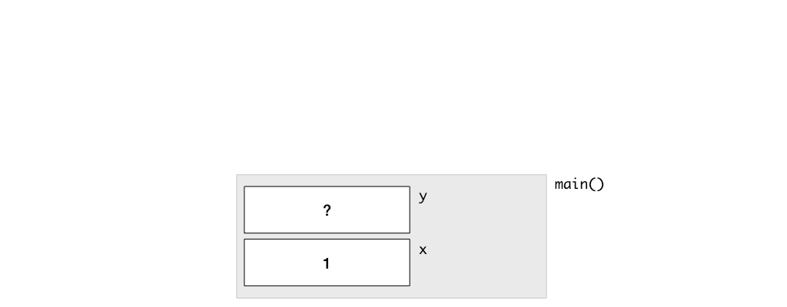
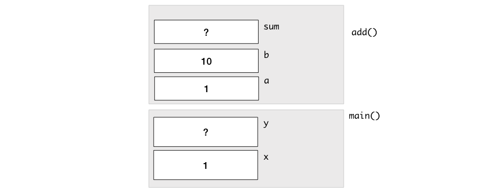
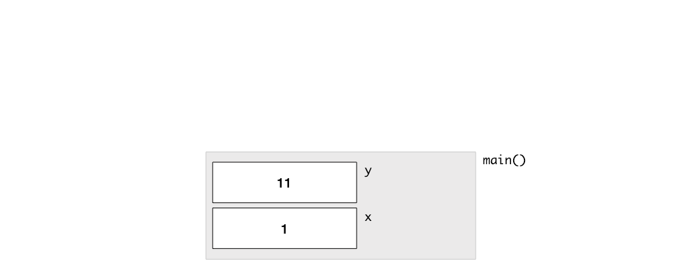

# Unit 13: Call Stack

In this unit, we will delve deeper into how variables are stored in the memory and what happens when we call a function.

## Stack Frame

Modern OS typically divide the memory into several regions.  The region that we are concerned with for now is called the _call stack_.  
Every function invocation causes the OS to allocate some memory on the call stack to store (among other things) the parameters passed into the function and the variables declared and used in the function.  The memory allocated to each function call is called a _stack frame_.  When a function returns, the stack frame is deallocated and freed up for other uses.

Let's start with the following simple program as an example.

```C
int main()
{
  long x = 1;
  long y;
}
```

When the OS runs the program above, it invokes, or calls, the function `main`.  A new stack frame is created for `main()`.  There are two variables `x` and `y` declared in `main`.  Recall from [Unit 2](02-algo.md) that a variable is a location in the memory which holds a value.  Thus, the stack frame of `main` will include these two variables.  We initialize `x` to 1 in the code above, so the value 1 will be placed in the memory location of `x`.  The variable `y` remains uninitialized, so it will contain whatever value that happens to be in the memory at that time.



Now, let's consider the program[^1]:

[^1]: The variable `sum` is not necessary and the function can be better written as a one-liner `return a + b;`.  But I introduce the additional variable `sum` here to make the example more meaningful in explaining about stack frame.

```C
long add(long a, long b) {
  long sum;
  sum = a + b;
  return sum;
}

int main()
{
  long x = 1;
  long y;
  y = add(x, 10);
}
```

Now, the program invokes the function `add` with two parameters, using `x` and 10 as arguments.  What the OS does when `add` is called, is that it allocates another stack frame for `add`.  We can visualize the stack frame for `add` as being placed on top of the stack frame of `main`.  The stack frame for `add` includes two variables corresponding to the parameters `a`, `b`, and the variable `sum` declared in the function `add`.

When the stack frame for `add` is created, `sum` is uninitialized, but `a` is initialized to whatever the value of `x` is when the function is invoked (1 in this example), and `b` is initialized to 10, since that is the argument passed into `add`.



After the stack frame for `add` is set up, the code is executed.  The memory location for `sum` is then initialized to the sum of `a` and `b` (11 in this example), and the return statement is executed.  


When a function returns, the stack frame for `sum` is removed.  The variables `sum`, `a`, `b` crumble into dust and no longer exist in the memory.  The value of the variable being returned (`sum` in this case) is then copied back to the stack frame of the `main` (the {--_callee_--} caller).  In this example, this value is copied into the memory location of `y`.



What would happen if we change the value of `a` within `add`?

```C
long add(long a, long b) {
  sum = a + b;
  a = 42;  // change a
  return sum;
}

int main()
{
  long x = 1;
  long y;
  y = add(x, 10);
}
```

In this example, we change the value of `a` in the call stack of `add` to 42.  This has no effect on any variable in `main`, since the changes apply only within the stack frame of `add`.

A common bug by beginners is to try to write a function this way:

```C
void add(long sum, long a, long b) {
  sum = a + b;
}

int main()
{
  long x = 1;
  long sum;
  add(sum, x, 10);
}
```

Here, there are actually two versions of `sum`, one in the stack frame of `main`, the other in the stack frame of `add`.  When we change `sum` in `add`, we are changing a local copy which will eventually get deleted.  The assignment to `sum` in Line 2 has no effect on the variable `sum` on Line 8 of `main`.

This explanation explains why a function is a black box, we can only pass in parameters and get a value in return.  Nothing else gets in and out.  There are no "side effects" -- whatever happen in the function, stays in the function and does not affect the caller (excepts if it reads or writes to the standard input/output).   Such a function is sometimes called a "pure function".

## Automatic Variable

Because of the way the memory for the variables are automatically allocated and deallocated when a function is invoked and when the function returns, we call these variables _automatic variables_.  

There are two other types of variables, _global variable_, which we have mentioned is a very very bad programming practice in Lecture 5 and is banned from CS1010, and _static variable_, which could be useful in rare occasion but we shouldn't concern ourselves with this type of variable in CS1010 for the moment.

## Stack Size

The OS typically reserves a limited amount of memory for each program for the stack.  You can find out, on your system, what is the maximum allocated stack size with the command
```
ulimit -s
```

On our CS1010 PE hosts, the limit is 8 MB.  

## Problem Set 13

### Problem 13.1

Trace through what gets stored in the call stack when we run the following programs:

```C
#include <math.h>

long square(long x)
{
  return x*x;
}

double hypotenuse_of(long base, long height)
{
  return sqrt(square(base) + square(height));
}

int main()
{
  hypotenuse_of(3, 4);
}
```

### Problem 13.2

Trace through what gets stored in the call stack when we run the following programs:

```C
#include "cs1010.h"

long factorial(long n)
{
  if (n == 0) {
    return 1;
  }
  return factorial(n-1) * n;
}

int main()
{
  factorial(3);
}
```

### Problem 13.3

What will be printed by the program below?
Trace through what gets stored in the call stack when we run the following programs:

```C
#include "cs1010.h"

void incr(long x) {
    x += 1;
}

int main()
{
    long x = 10;
    incr(x);
    incr(x);
    cs1010_print_long(x);
}
```
