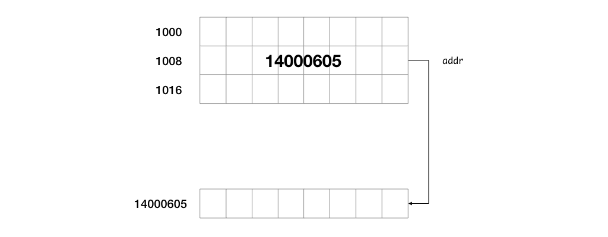
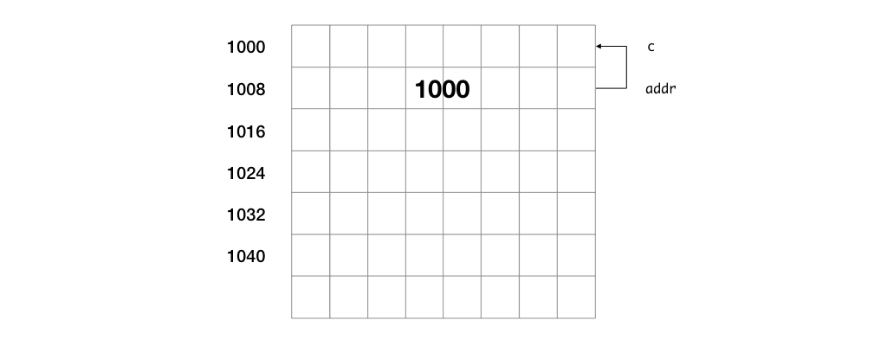

# Unit 14: Memory Addresses or Pointers

Every memory location has an address.  Unlike many higher level languages, such as Java, Python, and JavaScript, C allows us direct access to memory addresses.  This empowers programmers to do wonderful things that cannot be done in other languages.  But, it is also dangerous at the same time -- using it improperly can lead to bugs that are hard to track down and debug.

## The Address-of Operator

C has an operator called "address-of", denoted by `&`.  This operator, returns, well, the address of a variable.

We can type cast the address of a variable into `long` and print it out to examine its value.  Consider this:

```C
#include "cs1010.h"

void add(long sum, long a, long b) {
  sum = a + b;
  cs1010_println_long((long)&sum);
}

int main()
{
  long x = 1;
  long sum;
  add(sum, x, 10);
  cs1010_println_long((long)&sum);
}
```

Running the program above prints something like this:
```
140723025685528
140723025685552
```

Your results will most likely be different, since the OS allocates different regions of the memory to this program every time it is run.  


## The Deference Operator

The dereference operator is the reversed of address-of, and is denoted by `*`.  I call it "location-of-address".  We use this operator in two places:

- to declare an "address" variable, and
- to reference the location of an address.

We can declare a variable that is an address type.  We need to tell C the type of the variable this address is referencing.  For instance,

```C
double *addr;
```

declares a variable `addr` that is an address to a variable of type `double`.  The way to read this is that `*addr`, or location-of-address `addr` is of type `double`, so `addr` is an address of a location containing a `double`.

!!! warn "Common Bug"
    It is possible to write as
    ```C
    double* addr;
    ```
    too, but this is not recommended.  Suppose you want to declare two addresses, you might write, 
    ```C
    double* from_addr, to_addr;
    ```
    thinking that both `from_addr` and `to_addr` are of type `double*`.  But, actually, C treats `to_addr` as a `double`, not an address of a `double`!  In any case, if you follow CS1010 style, you shouldn't be declaring two variables in one line.

Another name for a variable of type address is _pointer_.  We can visualize a pointer as pointing to some location in the memory.

## Changing the Value via Pointer

Suppose we declare a pointer to a `double` variable (or, for short, a `double` pointer):
```C
double *addr;
```

We can use `*addr` just like a normal `double` variable:
```C
*addr = 1.0;
```

The line above means that, _we take the address stored in addr, go to the location at that address, and store the value 1.0 in the location._

This is where things can get dangerous.  You could be changing the value in a memory location that you do not mean to.  If you are lucky, your program crashes with a `segmentation fault` error[^2]. We say that your program has segfault.  If you are unlucky, your program runs normally but produces incorrect output occasionally.



So, _always make sure that your pointer is pointing to the right location before dereferencing and writing to the location._

[^2]: I leave it to the later OS classes CG2271 / CS2016 to explain the term "segmentation" and "fault".  Interested students can always google and [read on Wikipedia](https://en.wikipedia.org/wiki/Segmentation_fault).

In the code above, if we write:
```C
double *addr;
*addr = 1.0;
```

back-to-back, the program will almost certainly segfault, because the pointer variable `addr` is not initialized, so it is pointing to the location of whatever address happens to be in the memory at that time.

We should point addr to a value location first, like this:
```C
double c;
double *addr;
addr = &c;
*addr = 1.0;
```



Of course, the above could be simply written as:
```C
double c = 1.0;
```
I am just doing it the complicated way (which you should avoid unless you have good reasons to do so) to demonstrate the concept of pointers.

## Basic Rules About Using Pointers

1. When we use pointers, it must point to the variable of the same type as that declared by the pointer.  For instance,

```C
double pi = 3.1415926;
long radius = 5;
double *addr;
addr = &pi; // ok
addr = &radius; // not ok
```

Line 4 above would lead to a compilation error since we try to point a `double` pointer to a `long`.  

2. We cannot change the address of a variable.  For instance

```C
long x = 1;
long y = 2;
&x = &y; 
```

We try to set the address of `x` to be the address of `y`.  This is not allowed since allocation of variables in the memory is determined by the OS, a process we have no control over.

3. We can perform arithmetic operations on pointers, but not in the way you expect.

Suppose we have a pointer:
```C
long x;
long *ptr;
x = 1;
ptr = &x;
ptr += 1;
```

Suppose that `x` is stored in memory address 1000, after Line 4, `ptr` would have the value of 1000. 
After the line `ptr += 1`, using normal arithmetic operation, we would think that `ptr` will have the value of 1001.  However, the semantic for arithmetic operation is different for pointers.  The `+` operation for `ptr` causes the `ptr` variable to move forward by the size of the variable pointed to by the pointer.  In this example, `ptr` points to `long`, assuming that `long` is 8 bytes, after `ptr += 1`, `ptr` will have the value of 1008.

We can only do addition and subtraction for pointers.

## Pointer of Pointer (of Pointer..)

A pointer variable is also stored in the memory, so it itself has an address too.

```C
long x;
long *ptr;
ptr = &x;
```

For instance, in the above, `ptr` would have a memory location allocated on the stack too, and so it itself has an address, and we can have a variable `ptrptr` referring to the address of `ptr`.  What would the type of this variable be?  Since `ptr` is an address of `long`, `ptrptr` is an address of an address of `long`, and can be written as:

```C
long x;
long *ptr;
long **ptrptr;
ptr = &x;
ptrptr = &ptr;
```

This deference can go on since `ptrptr` is also a variable and have been allocated in some memory location on the stack.  We rarely need to dereference more than twice in practice, but if the situation arises, such multiple layers of dereferencing is possible.

## The `NULL` Pointer

`NULL` is a special value that is used to indicate that a pointer is pointing to nothing.  In C, `NULL` is actually 0 (i.e., pointing to memory location 0).

We use `NULL` to indicate that the pointer is invalid, typically to mean that we have not initialized the pointer or to flag an error condition.

!!! note "Billion Dollar Mistakes"
    Sir Tony Hoare (the same one whom we met when we talked about [Assertion](10-assert.md)) also invented the null pointer.  He called it his billion-dollar mistake.  Quoting from him: "I couldn't resist the temptation to put in a null reference, simply because it was so easy to implement. This has led to innumerable errors, vulnerabilities, and system crashes, which have probably caused a billion dollars of pain and damage in the last forty years."  As you start to use pointers in CS1010, you will see why it is a pain.

## Problem Set 14
### Problem 14.1

Sketch the content of the memory while tracing through the following code.  What would be printed?

```C
long *ptr1;
long *ptr2;
long x;
long y;

ptr1 = &x;
ptr2 = &y;

*ptr1 = 123;
*ptr2 = -1;

cs1010_println_long(x);
cs1010_println_long(y);
cs1010_println_long(*ptr1);
cs1010_println_long(*ptr2);

ptr1 = ptr1;
*ptr1 = 1946;

cs1010_println_long(x);
cs1010_println_long(y);
cs1010_println_long(*ptr1);
cs1010_println_long(*ptr2);

y = 10;

cs1010_println_long(x);
cs1010_println_long(y);
cs1010_println_long(*ptr1);
cs1010_println_long(*ptr2);
```

### Problem 14.2

What is wrong with both programs below?

```C
double *addr_of(double x)
{
  return &x;
}

int main()
{
  double c = 0.0;
  double *ptr;

  ptr = addr_of(c);
  *ptr = 10;
}
```


```C
double *triple_of(double x)
{
  double triple = 3 * x;
  return &triple;
}

int main()
{
  double *ptr;

  ptr = triple_of(10);
  cs1010_println_double(*ptr);
}
```
