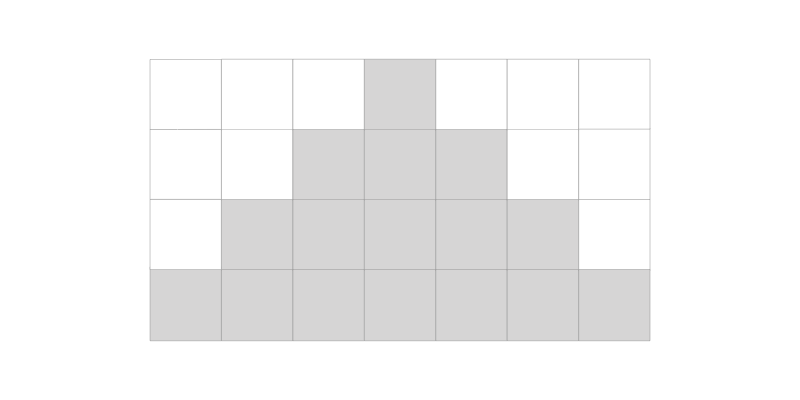
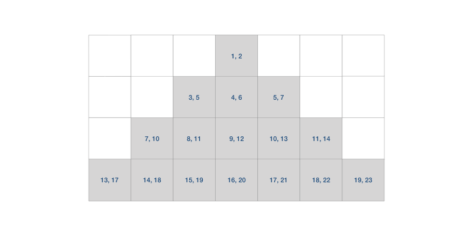
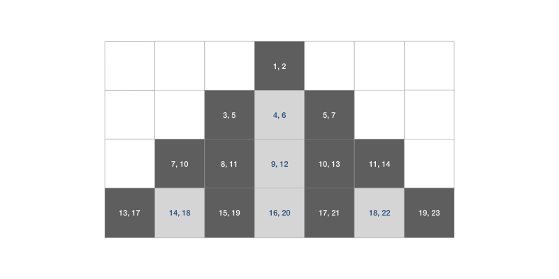

# Assignment 2: Collatz, Weekday, Circle, Pattern

### Deadline

21 September, 2018 (Friday), 6:00pm.

### Prerequisite

- You are able to access the [CS1010 programming environment](environments.md).
- You are familiar with [basic UNIX CLI](unix.md) and using terminal-based editor [`vim`](vim.md).
- You have gone through Exercise 1 and have already set up your `.gitconfig`.
- You are familiar with the steps of accepting, downloading, and submitting your exercise and assignment.
- You are familiar with the directory structure and the common files included in your assignment skeleton.

### Learning Outcomes

- Be comfortable writing simple C programs that involve arithmetic operations, `long`, `double`, and `bool` types, conditional `if`/`else` statements, and loops with `while`/`for`/`do-while` statements.
- Be comfortable breaking down a problem into smaller subproblems which can be resolved using functions, including reusing existing functions written for other programs (with a tweak), writing a function that calls itself, designing what should the inputs and return values/types of a function be.

### Setup

- [Click on this link](https://classroom.github.com/a/uJ6SQfBb) to accept the assignment.
- Login to one of the hosts of [CS1010 programming environment](environments.md)
- Run:

```
~cs1010/get-as02
```

- You should see the folder `as02-<github id>` in your home directory with the assignment skeleton inside.

### Solving The Assignments

- Edit the files `collatz.c`, `weekday.c`, `circle.c`, and `pattern.c` to solve the corresponding question as described below.
- You should break down the problem into smaller subproblems, and write one function for each of the subproblem to solve the problem.  
- To compile and run tests with the sample inputs and outputs:

```
make
```

- The test cases are given in the `inputs` and `outputs` subdirectory.  You can use `cat` or `less` to look at the content of these test cases.  You can add more test cases or edit the given ones if needed.

### Submission

When you are ready, run the following command to submit:

```
~cs1010/submit-as02
```

The four files `collatz.c`, `weekday.c`, `circle.c`, and `pattern.c` will be uploaded to GitHub.  You can submit multiple times, but only the last submission will be graded.

!!! warn "Editing Your Files in Multiple Locations"
    You should edit your code only on the CS1010 PE hosts.  If you choose to edit your code in other places, such as directly on Github or in a second location (such as your own laptop), you need to be comfortable with various `git` command to synchronize your code across the different locations, possibly needing to resolve synchronization conflicts.  

Only the four C files listed above will be submitted.  You can create additional C files for testing different solutions, but eventually, you must put your solution into the corresponding C file provided as the skeleton.

### Identifying Yourself

In every C file that you submit to CS1010, you need to identify yourself by writing your name and tutorial group. Marks will be deducted if you fail to do so. You need to edit the line:

```
@author XXXX (Group YYYY)
```

and change it to something like:

```
@author Elsa of Arendelle (Group 9)
```

### Grading

This assignment contributes towards 3% of your final grade.  The total mark for this assignment is 30 marks.  There are two marking criteria: correctness and style.  

For each question, 2 marks are allocated for coding style.  Please refer to the [CS1010 C Style Guide](style.md) and follow the recommended guideline.

The rest of the marks are allocated to correctness.  Note that passing the tests does not guarantee that your code is correct.  Even if your code produces the correct output all the time, you may still lose marks if you do not write your code properly (e.g., using the most appropriate type, violating the constraints set by the question).

## Question 1: Collatz (6 marks)

The [Collatz Conjecture](https://en.wikipedia.org/wiki/Collatz_conjecture) was introduced by the mathematician Lothar Collatz in 1937.   Also known as the $3n+1$ conjecture, the problem can be stated very simply but yet no one is able to prove that it is true or false.  The conjecture states the following:

Consider the following operation on a positive integer $n$: if $n$ is even, divide it by two; otherwise, triple it and add one.  Suppose we form a sequence of numbers by performing this operation repeatedly, beginning with any positive integer, then this process will eventually reach the number 1, for any initial positive integer $n$.

For instance, if $n = 10$, then we have the sequence $10 \rightarrow 5 \rightarrow 16 \rightarrow 8 \rightarrow 4 \rightarrow 2 \rightarrow 1$.

The smallest number of steps taken by this process for $n$ to reach 1 is called the _total stopping time_.  In the example above, the total stopping time for 10 is 6.

Write a program `collatz.c` that reads in a positive integer $N$ from the standard input and finds out, among the numbers between 1 to $N$, inclusive, which one has the largest total stopping time.  If two numbers have the same total stopping time, we break ties by choosing the larger number as the answer.  Your program should print to the standard output, the number with the largest total stopping time and its corresponding total stopping time.

### Sample Run
```
ooiwt@pe114:~/as02-skeleton$ ./collatz
1
1
0
ooiwt@pe114:~/as02-skeleton$ ./collatz
10
9
19
ooiwt@pe114:~/as02-skeleton$ ./collatz
1000
871
178
```

## Question 2: Weekday (6 marks)

Write a program `weekday.c` that reads three positive integers representing the year, month, and day of a date respectively, and prints out which day of the week this date is to the standard output.  Possible outputs are "Monday", "Tuesday", "Wednesday", "Thursday", "Friday", "Saturday", and "Sunday". The earliest date that can be given as input is January 1, 1900 (which is a Monday).

You may find reusing functions you have written in [Exercise 2](ex02.md) useful.

### Sample Run
```
ooiwt@pe114:~/as02-skeleton$ ./weekday
1900 1 1
Monday
ooiwt@pe114:~/as02-skeleton$ ./weekday
1904 2 29
Monday
ooiwt@pe114:~/as02-skeleton$ ./weekday
2018 9 14
Friday
```

## Question 3: Circle (6 marks)

Write a program `circle.c` that reads in a positive integer $r$ from the standard input, and prints a circle of radius $r$ to the standard output.

We can consider this circle as being printed on a canvas of size $(2r+1) \times (2r+1)$, with the top left corner being $(0, 0)$ and the center of the circle at the position $(r, r)$.  The figure below shows an example with $r = 2$.


For each location $(x, y)$, let the distance of $(x, y)$ to the center be $d_{x,y}$.  To print the circle, we print the following for each location $(x,y)$:

- if $|d_{x,y} - r| < 0.1$, print `@`
- otherwise, if $|d_{x,y} - r| < 0.3$, print `O` (that's uppercase o, not zero)
- otherwise, if $|d_{x,y} - r| < 0.5$, print `*`
- otherwise, if $|d_{x,y} - r| < 0.7$, print `+`
- otherwise, print ` ` (white space)

Your output must contain exactly $2r+1$ rows, each row exactly $2r+1$ characters (including the white spaces but excluding the newline).  Note that in the sample runs below, the white spaces are not visible.

### Sample Run
```
ooiwt@pe114:~/as02-skeleton$ ./circle
1
*@*
@ @
*@*
ooiwt@pe114:~/as02-skeleton$ ./circle
5
   *@@@*   
 +@+   +@+
 @       @
*+       +*
@         @
@         @
@         @
*+       +*
 @        @
 +@+   +@+
   *@@@*   
ooiwt@pe114:~/as02-skeleton$ ./circle
10
       *O@@@O*       
     OO+     +OO     
   +@+         +@+   
  +O             O+  
  @               @  
 O+               +O
 O                 O
*+                 +*
O                   O
@                   @
@                   @
@                   @
O                   O
*+                 +*
 O                 O
 O+               +O
  @               @  
  +O             O+  
   +@+         +@+   
     OO+     +OO     
       *O@@@O*       
```

## Question 4: Pattern (12 marks)

Even though the sequence of prime numbers appears to be random, mathematicians have found some intriguing patterns related to prime numbers.  In this question, you are asked to write a program to draw a variation of the ["Parallax Compression" pattern discovered by a software engineer, Shaun Gilchrist](http://www.novaspivack.com/science/we-have-discovered-a-new-pattern-in-the-prime-numbers-parallax-compression).

The pattern visualizes the distribution of prime number in a triangle, in the following way.  The inputs given are an _interval_ $n$ ($n \ge 1$) and the height of the triangle $h$.

The triangle has $h$ rows.  The first row of the triangle has one cell, the second row has three cells, the third row has five, etc.  The cells are centrally aligned so that visually they form an equilateral triangle.  We call the left-most cell of each row the _leading cell_.

Each cell in the triangle contains $n$ integers.  The first cell in the first row contains the numbers 1, 2, ..., $n$.  The leading cell of the next row, row 2, contains $n$ numbers between $n+1$ and $3n$, with increment of 2: i.e., $n+1, n+3, n+5, .. n+(2n-1)$.  The leading cell of the next row, row 3, contains the numbers $3n + 1$ and $6n$, with increment of 3: i.e., $3n+1, 3n+4, 3n+7, .. 3n+(3n-2)$, etc.  For instance, if $n$ is 5, the leading cells of the first three rows contain the numbers [1, 2, 3, 4, 5], [6, 8, 10, 12, 14], [16, 19, 22, 25, 28], respectively.

The rest of the cells in each row contains $n$ numbers where each is one more than a number contained in the cell on its left.  So, in row 2, the numbers in the three cells are [6, 8, 10, 12, 14], [7, 9, 11, 13, 15] and [8, 10, 12, 14, 16].  In row 3, the cells contain [16, 19, 22, 25, 28], [17, 20, 23, 26, 29], [18, 21, 24, 27, 30], [19, 22, 25, 28, 31], and [20, 23, 26, 29, 32].

Now, to visualize the distribution of primes, we do the following, for each cell of the triangle that contains at least one prime, we print `#` to the standard output at the corresponding position.  Otherwise, we print ` ` (a white space).

Your output must contain exactly {--2r+1--} $h$ rows, each row exactly {--2r+1--} $2h+1$ characters (including the white spaces but excluding the newline).  Note that in the sample runs below, the white spaces are not visible.

### Example 1
```
ooiwt@pe114:~/as02-skeleton$ ./pattern
2 4
   #   
  # #  
 ## ##
# # # #
```

See the figures below:



The figure above shows the shape of the triangle with height 4.  The shaded locations belong to the triangle.  Each square represents a cell.



The figure above shows the integers contained in each of the triangle cells with an interval of 2.



The figure above shows the pattern that emerges if we color each cell that contains at least one prime a darker shade.  In our program, we use `#` to represent such a cell.

### More Examples
```
ooiwt@pe114:~/as02-skeleton$ ./pattern
11 11
          #
          #
        ## ##
       # # # #
      #### ####
      # #   # #
    ###### # ####
   # # # # # # # #
  ## ## ## ## ## ##
  # # # #   # # # #
###### ### ##########
ooiwt@pe114:~/as02-skeleton$ ./pattern
100 29
                            #
                           # #
                          ## ##
                         # # # #
                        #### ####
                       #   # #   #
                      ###### ######
                     # # # # # # # #
                    ## ## ## ## ## ##
                   # #   # # # #   # #
                  ########## ##########
                 #   # #   # #   # #   #
                ############ ############
               # # #   # # # # # #   # # #
              ## #  ##  # ## ## #  ##  # ##
             # # # # # # # # # # # # # # # #
            ################ ################
           #   # #   # #   # #   # #   # #   #
          ################## ##################
         # #   # # # #   # # # #   # # # #   # #
        ## ##  # ## #  ## ## ## ##  # ## #  ## ##
       # # # # #   # # # # # # # # # #   # # # # #
      ###################### ######################
     #   # #   # #   # #   # #   # #   # #   # #   #
    #### #### #### #### #### #### #### #### #### ####
   # # # # # #   # # # # # # # # # # # #   # # # # # #
  ## ## ## ## ## ## ## ## ## ## ## ## ## ## ## ## ## ##
 # # #   # # # # # #   # # # # # #   # # # # # #   # # #
############################ ############################
```
