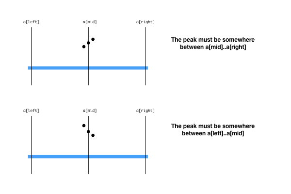
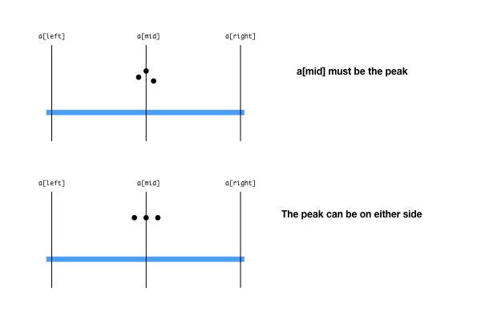
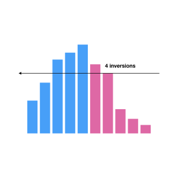
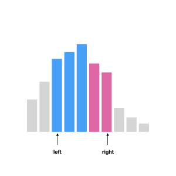

# Assignment 7: Comments

## Notes on Marking Schemes

For brevity, I won't repeat the detailed marking scheme, as it is the same as before.  One major change is that we start to deduct marks for documentation format errors.

The other major change is that we start to award marks based on the efficiency of the solution.

## Answer Keys

### Peak

For an array with distinct elements, we need to take $O(\log n)$ steps.  This hints that we need to cut down the possiblity of where the peak is by half at every comparison.  We can do something similar to binary search -- to check the middle element, and use it to decide where the peak could be.

Here are the six cases:





The more tricky case is what happen when the middle point has the same elevation on either side.  In which case, we cannot tell where the peak is and we will have to search both sides for the peak.  This is the reason why if the elevation is not distinct, then the running time is more than $O(\log n)$ (but still less than $O(n)$).

```C
**
 * Check if there's a peak (an elevation that is higher than
 * both points on its left and right side) in the range
 * a[start]..a[end].
 *
 * @param[in] a The array of elevations.
 * @param[in] start The staring index.
 * @param[in] end The ending index.
 * @return Return the index of peak, or NO_PEAK if no peak exists
 */
#define NO_PEAK (-1)

long find_peak(const long a[], long start, long end) {
  // There is no peak if less than 3 elements.
  if (end < start + 2) {
    return NO_PEAK;
  }

  long mid = (start + end) / 2;

  // mid is higher than the nearby points, and hence it's a peak
  if (a[mid - 1] < a[mid] && a[mid + 1] < a[mid]) {
    return mid;
  }

  // mid is at the same height as both left and right.  We have to
  // check both sides for peak.  Let's do the left side first.
  if (a[mid - 1] == a[mid] && a[mid + 1] == a[mid]) {
    long position = find_peak(a, start, mid);
    if (position != NO_PEAK) {
      return position;
    }
    // There is no peak on the left side.  Check the right side.
    return find_peak(a, mid, end);
  }

  // Check for peak on the right side.
  if (a[mid - 1] <= a[mid] && a[mid + 1] >= a[mid]) {
    return find_peak(a, mid, end);
  }

  // Check for peak on the left side.
  // { (a[mid - 1] >= a[mid] && a[mid + 1] <= a[mid]) }
  return find_peak(a, start, mid);
}
```

### Scripts

The hint for this one is actually pretty obvious. So there is nothing to say :)  Here is the code:

```C
/**
 * Given an array in[] of integers containing an increasing sequence
 * followed by a decresing sequence, rearrange the array so that
 * it becomes sorted.
 * @param[in]  len The length of the array in[].
 * @param[in]  in  The input array to be sorted.
 * @param[out] out The output array.
 * @pre The array in contains a (possibly empty) increasing sequence
 *      followed by a decreasing sequence.
 * @post The array out is sorted.
 */
void sort(long len, const long in[len], long *out) {
  long left = 0;
  long right = len - 1;
  long out_pos = 0;
  while (left <= right) {
    if (in[left] < in[right]) {
      out[out_pos] = in[left];
      left += 1;
    } else {
      out[out_pos] = in[right];
      right -= 1;
    }
    out_pos += 1;
  }
}
```

I can, however, add a few more words on this.  This algorithm, which merges two sorted array into one, is better known as, well, the merge algorithm, and it is a basic step in a fast sorting algorithm called merge sort, which runs in $O(n \log n)$.  The basic idea of merge sort is to split an input array into two halves, recursively sort each half.  Now you have a situation similar to John's, which you can merge into a sorted array in $O(n)$ time.  It's pretty cool.  You can check out the animation from [Visualgo](https://visualgo.net/bn/sorting)


### Inversion

For 20 marks, you just need one line of code -- if you know what you are doing.  Let me show you the solution first -- which is a modified version of the `sort` function from `scripts`:

```C
long count_inversions(long len, long in[len]) {
  long left = 0;
  long right = len - 1;
  long sum = 0;
  while (left <= right) {
    if (in[left] < in[right]) {
      left += 1;
    } else {
      sum += right - left;  // <- 20 marks
      right -= 1;
    }
  }
  return sum;
}
```

Let's analyze the problem and see how to come up with this solution.

When we count inversions, we need to be careful about counting every pair once.  This is something you should have learned from `kendall`.   So we have to decide, for an element, whether we want to count inversions to the left or to the right of the element (but not both).   In our solution, we decided to count the inversions for elements to the left -- in other words, for an element `in[i]`, we count the number of elements from   `in[0]..in[i-1]` that are bigger than `in[i]`.

An $O(n^2)$ solution scans from `in[0]` to `in[i-1]`, for each `i`.  This is a double-loop solution that will given you 0 marks.  

To get a faster solution, let's look at an example input below:


The blue elements are already sorted, so each element `in[i]` here does not contribute to the count on the number of inversions.

The purple elements, however, are inversely sorted so they contributes to the number of inversions.  Every purple elements on the left of `in[i]` is one inversion.  But that is not all, some of the blue elements are larger than `in[i]`, so we have to count those inversions as well.  The figure below shows that `in[6]` contributes 4 to the number of inversions since there are 4 elements to its left that is larger.



Now, the question is how to find how many blue elements are larger than `in[i]`.  The hints give some ideas.

The first hint is to use binary search.  Since the blue elements are sorted, we can use binary search to find the position in which we should insert `in[i]`.  (There is a in-class tutorial programming exercise on this).  That takes $O(\log n)$ time for each element.  So the running time for this approach is $O(n \log n)$.  

The second hint is to use sort, which we just solved in the problem `scripts`.  Here is the sorting algorithm, again:

```C
void sort(long len, const long in[len], long *out) {
  long left = 0;
  long right = len - 1;
  long out_pos = 0;
  while (left <= right) {
    if (in[left] < in[right]) {
      out[out_pos] = in[left];
      left += 1;
    } else {
      out[out_pos] = in[right];
      right -= 1;
    }
    out_pos += 1;
  }
}
```

Why does this algorithm work?   This algorithm actually maintains the following invariant
```
Every element in in[0]..in[left-1] < min(in[left], in[right])
Every element in in[right+1]..in[len-1] < min(in[left], in[right])
Every element in in[left+1]..in[right-1] > min(in[left], in[right])
```

which is why putting the minimum of `in[left]` and `in[right]` to the output array ensures that it is in sorted order.

The figures below illustrate this invariant -- elements in `in[0]..in[left-1]` and `in[right+1]..in[len-1]` are in gray.



Since we only move `left` or `right` on the smaller of the `in[left]` or `in[right]`, the invariant is maintained in every loop. 

Let's consider the case where `in[right] < in[left]`.    We can simplify the invariants to:

```
Every element in in[0]..in[left-1] < in[right]
Every element in in[right+1]..in[len-1] < in[right]
Every element in in[left]..in[right-1] > in[right] 
```

The last invariant is the key to count the inversions -- we can conclude that `in[right]` contributes (`right` - 1) - `left` + 1 inversions to the total count.   Hence the line:

```C
long count_inversions(long len, long in[len]) {
  long left = 0;
  long right = len - 1;
  long sum = 0;
  while (left <= right) {
    if (in[left] < in[right]) {
      left += 1;
    } else {
      sum += right - left;  // <- 20 marks
      right -= 1;
    }
  }
  return sum;
}
```

I think this question illustrates strongly my point at the very first lecture: writing code is easy, but knowing what to write is not!  
